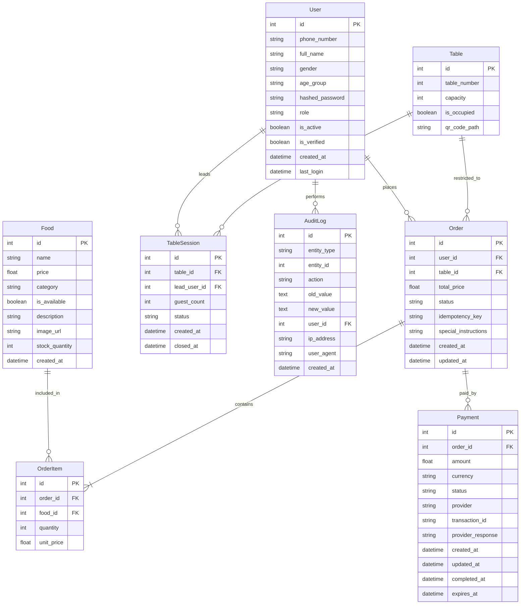

# Database ERD

This document contains the Entity-Relationship Diagram (ERD) for the "Contacless Order Service" database, generated using Mermaid syntax.

## Entity Relationship Diagram

## Description of Entities

- **User**: Represents customers, staff, and managers. Stores profile and authentication data.
- **Table**: Represents physical tables in the restaurant with QR code tracking.
- **Food**: The digital menu items, including pricing and stock levels.
- **TableSession**: Tracks a group of guests at a specific table, led by a "lead user".
- **Order**: Represents a customer order, linked to a user and a table.
- **OrderItem**: Individual line items within an order, linking to specific food items.
- **Payment**: Tracks payment transactions via various providers (VietQR, Cash, etc.).
- **AuditLog**: Security and compliance log for tracking critical system actions.
