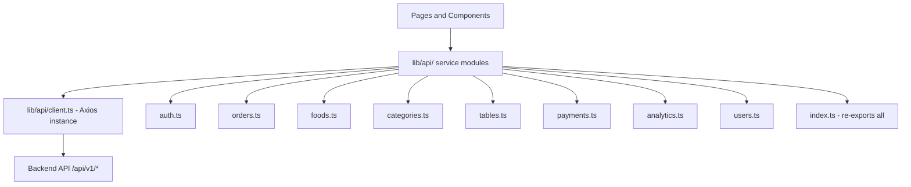

# Refactor API Calls to `lib/api/` for Easy Debug and Management

## Problem

Currently, API calls are scattered across **15+ files** (pages, components, hooks) using raw `api.get()`, `api.post()`, `api.put()`, etc. directly. This makes it hard to:
- Debug which endpoints are being called
- Change API contracts in one place
- Reuse API logic across components
- Add consistent error handling per endpoint

## Current State

### Existing Infrastructure
- [`frontend/lib/api.ts`](frontend/lib/api.ts) — Axios instance with interceptors (auth token, error handling, logging)
- [`frontend/lib/auth.ts`](frontend/lib/auth.ts) — Auth functions that already use the api instance
- [`frontend/lib/errorLogger.ts`](frontend/lib/errorLogger.ts) — Error logging utility

### Files with Direct API Calls (non-test files)

| File | API Calls | Endpoints Used |
|------|-----------|----------------|
| [`frontend/app/admin/orders/page.tsx`](frontend/app/admin/orders/page.tsx) | 4 | orders, analytics/revenue, orders/:id |
| [`frontend/app/admin/foods/page.tsx`](frontend/app/admin/foods/page.tsx) | 7 | foods, categories, foods/:id, foods/:id/stock, foods/:id/image |
| [`frontend/app/admin/categories/page.tsx`](frontend/app/admin/categories/page.tsx) | 4 | categories |
| [`frontend/app/admin/tables/page.tsx`](frontend/app/admin/tables/page.tsx) | 6 | tables, orders, tables/:id, tables/:id/regenerate-qr |
| [`frontend/app/admin/login/page.tsx`](frontend/app/admin/login/page.tsx) | 2 | auth/login, users/me |
| [`frontend/app/menu/page.tsx`](frontend/app/menu/page.tsx) | 1 | orders |
| [`frontend/app/order/[id]/page.tsx`](frontend/app/order/[id]/page.tsx) | 1 | orders/:id/cancel |
| [`frontend/app/order/track/page.tsx`](frontend/app/order/track/page.tsx) | 1 | orders |
| [`frontend/app/payment/page.tsx`](frontend/app/payment/page.tsx) | 3 | payments/:id, orders/:id/pay-cash, payments/initiate |
| [`frontend/app/register/page.tsx`](frontend/app/register/page.tsx) | 1 | auth/register |
| [`frontend/contexts/AdminAuthContext.tsx`](frontend/contexts/AdminAuthContext.tsx) | 2 | auth/login, users/me |
| [`frontend/components/CartDrawer.tsx`](frontend/components/CartDrawer.tsx) | 1 | users/me |
| [`frontend/hooks/useDashboardData.ts`](frontend/hooks/useDashboardData.ts) | 7 | analytics/revenue, orders, tables |
| [`frontend/hooks/useAnalyticsData.ts`](frontend/hooks/useAnalyticsData.ts) | 9 | analytics/* endpoints, users |
| [`frontend/hooks/useExportReport.ts`](frontend/hooks/useExportReport.ts) | 2 | various via endpoint param |
| [`frontend/lib/auth.ts`](frontend/lib/auth.ts) | 5 | auth/*, tables/:id/session, users/me/lead-info |

## Proposed Architecture



### New File Structure

```
frontend/lib/api/
├── client.ts          # Axios instance + interceptors (moved from lib/api.ts)
├── index.ts           # Re-exports everything
├── auth.ts            # authApi: login, logout, register, guestAuth, demographics
├── orders.ts          # ordersApi: list, getById, create, cancel, updateStatus, payCash
├── foods.ts           # foodsApi: list, create, update, delete, updateStock, toggleAvailability, uploadImage
├── categories.ts      # categoriesApi: list, create, update, delete, toggleActive
├── tables.ts          # tablesApi: list, create, update, delete, regenerateQr, createSession
├── payments.ts        # paymentsApi: initiate, getStatus
├── analytics.ts       # analyticsApi: revenue, popularItems, peakHours, customers, retention
└── users.ts           # usersApi: getMe, list, updateLeadInfo
```

### Example API Module Pattern

Each module follows this pattern:

```typescript
// frontend/lib/api/orders.ts
import { api } from './client';

export const ordersApi = {
  list: (params?: { limit?: number }) =>
    api.get('/orders/', { params }).then(r => r.data),

  getById: (id: number) =>
    api.get(`/orders/${id}`).then(r => r.data),

  create: (data: CreateOrderRequest) =>
    api.post('/orders/', data).then(r => r.data),

  cancel: (id: number) =>
    api.post(`/orders/${id}/cancel`),

  updateStatus: (id: number, status: string, extra?: Record<string, unknown>) =>
    api.put(`/orders/${id}`, { status, ...extra }),

  payCash: (id: number) =>
    api.post(`/orders/${id}/pay-cash`),
};
```

### Usage in Components (Before vs After)

**Before:**
```typescript
import api from '@/lib/api';
const response = await api.get('/orders/?limit=500');
const orders = response.data;
```

**After:**
```typescript
import { ordersApi } from '@/lib/api';
const orders = await ordersApi.list({ limit: 500 });
```

## Migration Strategy

1. **Create new `lib/api/` directory** with all service modules
2. **Move axios instance** from `lib/api.ts` to `lib/api/client.ts`
3. **Keep `lib/api.ts` as a backward-compatible re-export** temporarily (or update all imports at once)
4. **Refactor each page/component/hook** to import from `lib/api` service modules
5. **Update `lib/auth.ts`** to use the new auth API module (or merge into it)
6. **Verify** no raw `api.get/post/put/patch/delete` calls remain outside `lib/api/`

## Key Benefits

- **Single source of truth** for each API endpoint
- **Easy to debug** — add logging/breakpoints in one place per domain
- **Type-safe** — return types defined once per function
- **Consistent error handling** — can add per-domain error handling
- **Easy to mock** in tests — mock the service module instead of axios
- **Discoverable** — developers can see all available API calls in one place
