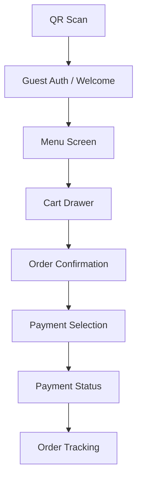

# UI Requirements Document

This document specifies the frontend screens, components, and interactions required for the **Contacless Order Service** mobile-first web application.

---

## 1. Design Principles

| Principle | Description |
|-----------|-------------|
| **Mobile-First** | Primary target: smartphone via QR scan. Desktop is secondary. |
| **Vietnamese-First** | Default language is Vietnamese. Icons over text where possible. |
| **Speed** | Max 3 taps to order. No unnecessary modals or confirmations. |
| **Accessibility** | Minimum 44px touch targets. High contrast for outdoor use. |

---

## 2. Screens Overview

---

## 3. Screen Specifications

### 3.1 Welcome / Guest Auth Screen
**Endpoint:** `POST /api/v1/auth/guest`

| Element | Type | Behavior |
|---------|------|----------|
| Restaurant Logo | Image | Centered at top |
| Table Number | Badge | Auto-populated from QR `table_id` |
| "Start Ordering" Button | Primary CTA | Calls guest auth, stores JWT |
| "Login with Phone" Link | Secondary | Opens phone/password form |

**State:** If cookie `guest_user_id` exists, auto-login and skip to Menu (TC-AUTH-07).

---

### 3.2 Menu Screen
**Endpoint:** `GET /api/v1/foods/?category=X`

| Element | Type | Behavior |
|---------|------|----------|
| Category Tabs | Horizontal Scroll | Fetched from `/foods/categories` |
| Food Card | Grid Item | Image, name, price, "Add" button |
| Cart FAB | Floating Button | Shows item count badge, opens Cart Drawer |
| Search Bar | Input | Client-side filter by name |

**Food Card States:**
- `is_available: true` → Normal
- `is_available: false` → Greyed out, "Sold Out" overlay, unclickable

---

### 3.3 Cart Drawer (Bottom Sheet)
**Local State:** Cart is managed client-side until order submission.

| Element | Type | Behavior |
|---------|------|----------|
| Item Row | List Item | Name, quantity stepper (+/-), subtotal |
| Special Instructions | Textarea | Optional, maps to `special_instructions` field |
| Total Price | Text | Sum of all items |
| "Place Order" Button | Primary CTA | Submits to `POST /api/v1/orders/` |

**Validation:**
- Disable "Place Order" if cart is empty.
- Show loading spinner during API call.

---

### 3.4 Order Confirmation Screen
**Endpoint Response:** After `POST /api/v1/orders/`

| Element | Type | Behavior |
|---------|------|----------|
| Success Animation | Lottie/GIF | Checkmark animation |
| Order ID | Text | Displayed for reference |
| Cancel Button | Destructive | Visible for **120 seconds** only (TC-ORDER-09) |
| "Proceed to Payment" | Primary CTA | Navigates to Payment Selection |

**Timer Logic:**
- Show countdown: "Cancel available for 1:58..."
- After 2 minutes, hide Cancel button.

---

### 3.5 Payment Selection Screen
**Endpoint:** `POST /api/v1/payments/initiate`

| Element | Type | Behavior |
|---------|------|----------|
| MoMo Button | Payment Option | Shows MoMo logo, initiates payment |
| VNPay Button | Payment Option | Shows VNPay logo, initiates payment |
| Cash Option | Payment Option | Displays "Pay at counter" message |
| Timer | Countdown | Shows 15-minute payment window |

**Flow:**
1. User selects provider.
2. App calls `/payments/initiate` with `provider` param.
3. Redirect to provider's payment page (deep link or WebView).
4. On return, poll `/payments/status/{tx}` or await webhook.

---

### 3.6 Payment Status Screen
**Endpoint:** `GET /api/v1/payments/status/{transaction_id}`

| Status | UI State |
|--------|----------|
| `pending` | Loading spinner, "Waiting for confirmation..." |
| `completed` | Success screen, confetti animation, "Order Paid!" |
| `failed` | Error message, "Retry Payment" button |
| `expired` | "Payment timed out", option to re-initiate |

---

### 3.7 Order Tracking Screen (Optional - Phase 2)
**Endpoint:** `GET /api/v1/orders/{id}` (polling or WebSocket)

| Order Status | UI Representation |
|--------------|-------------------|
| `pending` | Step 1 active: "Order Received" |
| `confirmed` | Step 2 active: "Kitchen Confirmed" |
| `preparing` | Step 3 active: "Cooking..." (animated) |
| `ready` | Step 4 active: "Ready for Pickup!" + notification |

---

## 4. Component Library Checklist

| Component | Priority | Notes |
|-----------|----------|-------|
| `<CategoryTabs />` | P0 | Horizontal scroll, sticky |
| `<FoodCard />` | P0 | Image, Sold Out state |
| `<CartDrawer />` | P0 | Bottom sheet, quantity stepper |
| `<PaymentButton />` | P0 | Provider logo + name |
| `<CountdownTimer />` | P1 | For cancel window & payment expiry |
| `<OrderStatusStepper />` | P2 | Vertical stepper for tracking |

---

## 5. API Integration Notes

### Authentication
- Store JWT in `localStorage`.
- Store `guest_user_id` cookie with `HttpOnly` flag (set by backend).
- Include `Authorization: Bearer <token>` header on all protected requests.

### Error Handling
| HTTP Code | User Message |
|-----------|--------------|
| `400` | Display `detail` from response body |
| `401` | Redirect to Welcome screen |
| `403` | "You don't have permission" |
| `404` | "Item not found" |
| `422` | Show validation errors inline |
| `500` | "Something went wrong. Please try again." |

### Real-time (Phase 2)
- Connect to `ws://host/ws/kitchen` for live order updates (kitchen display).
- Customer app can optionally poll order status every 10s.

---

## 6. Responsive Breakpoints

| Breakpoint | Target |
|------------|--------|
| `< 640px` | Mobile (primary) |
| `640px - 1024px` | Tablet |
| `> 1024px` | Desktop / Kitchen Display |

---

## 7. Assets Required

| Asset | Format | Notes |
|-------|--------|-------|
| Restaurant Logo | SVG/PNG | Provided by client |
| Food Images | WebP | 400x300px, lazy-loaded |
| Payment Logos | SVG | MoMo, VNPay, Cash icon |
| Empty States | SVG | Empty cart, no search results |
| Animations | Lottie JSON | Success checkmark, cooking |

---

## 8. Testing Checklist for UI

| Test Case | Screen | Validation |
|-----------|--------|------------|
| TC-UI-01 | Menu | Sold out items are not clickable |
| TC-UI-02 | Cart | Cannot submit empty cart |
| TC-UI-03 | Order | Cancel button disappears after 2 min |
| TC-UI-04 | Payment | Timer shows 15:00 countdown |
| TC-UI-05 | All | Error messages display correctly |
| TC-UI-06 | Menu | Category tabs scroll horizontally |
| TC-UI-07 | Auth | Returning guest auto-logs in |
